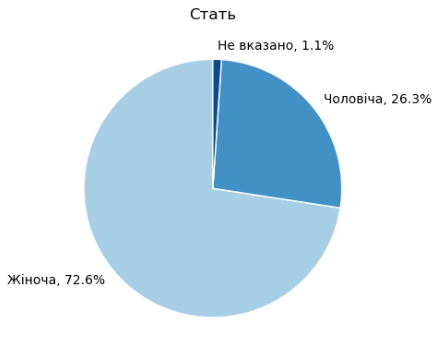
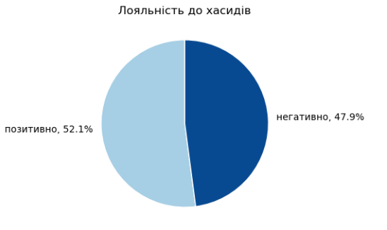
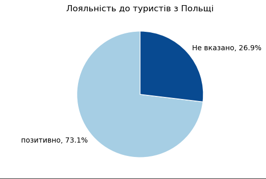
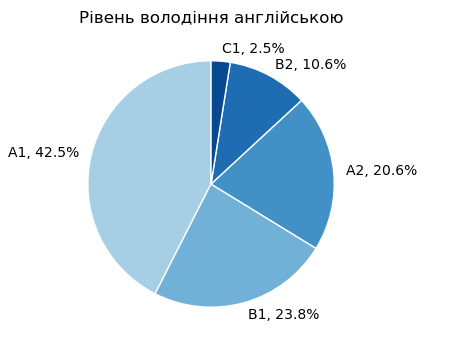
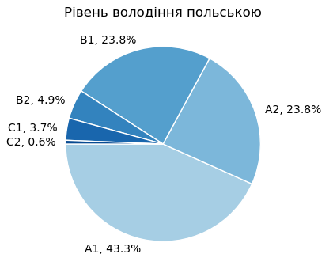
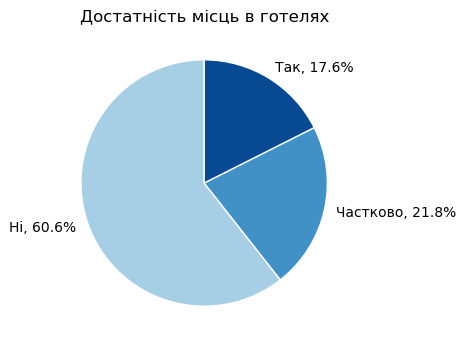
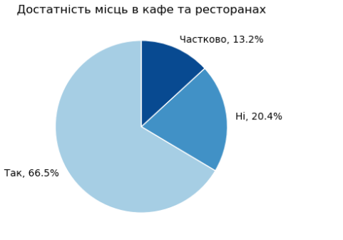
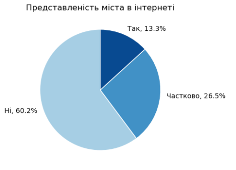
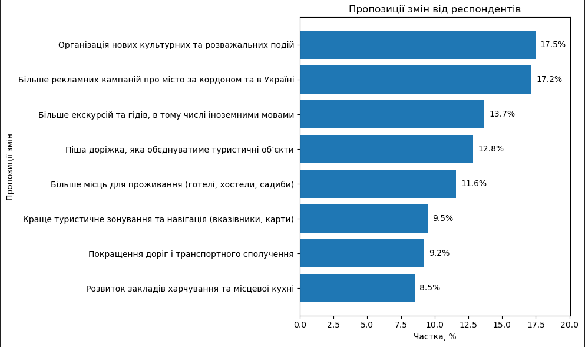
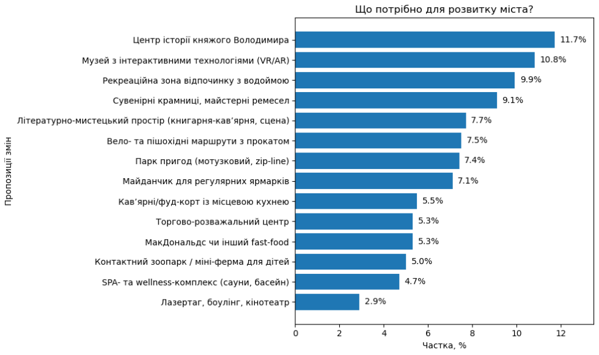

## Що думають мешканці та гості про туризм у Володимирі?
 <pre>В рамках написання дипломної роботи, я вирішив дослідити,  що ж насправді думають жителі міста про стан туристичної галузі у місті.</pre>
  
 Разом з ДІКЗ "Стародавній Володимир",  Громадська організація «СТАН» у Володимирі,  та Відділ міжнародної діяльності та туризму у Володимир-Волинській територіальній громаді було проведено опитування серед жителів та туристів міста Володимир, щоб з’ясувати, як вони оцінюють наш туристичний потенціал і що хотіли б бачити у майбутньому.</pre>
  
Всього було опитано 186 респондентів

  
Серед яких представники наступних проблем:

  <ul>
    <li>Працівники               - 55.23%</li>
    <li>Приватні підприємеці   - 12.79%</li>
    <li>Пенсіонери               - 11.63%</li>
    <li>Тимчасово непрацевлаштовані     -  8.72%</li>
    <li>Учні                   -  4.65%</li>
    <li>Військовослужбовеці     -  4.65%</li>
    <li>Студенти                 -  2.33%</li>
  </ul>

  
Межа похибки результатів, при рівні довіри 95% складає 7,2%, що є середнім результатом для вибірки

### 🧑‍🤝‍🧑 Хто взяв участь?

- Учасники різного віку та статі.
- Більшість мешкає у Володимирі понад 20 років, але були й молодші респонденти, які живуть тут до 10 років.

### 👩👨 Розподіл по статті
В опитуванні прийняло участь:
- 👩 Жінок - 72,6%
- 👨 Чоловіків - 26,3%
- ❓ Не вказали стать - 1,1%
 

### Ставлення до хасидських паломників
- Рівень довіри до хасидських паломників крайнє незадовільний, лише 26,9% лояльні до туристів.

### Туристи з інших країн
Водночас щодо туристів з польщі жоден з респондентів не висловив негативного ставлення. Що задає загальний напрямок розвитку для населення міста.

Аналогічна ситуація спостерігається й щодо туристів з інших країн:

#### Для розуміння туристичного потенціалу міста, крайнє важливо розуміти рівень володіння населення іноземними мовами, що забезпечить якісну комунікацію з туристами

##### Рівень володіння Англійською мовою

##### Рівень володіння Польською мовою

###  Достатність місць в готелях

- Першочергова потреба гостів міста - ночліг. Не маючи достатньої кількості готельних номерів, місто не зможе затримувати туристів більш ніж на добу, в той час коли турист залишається на ніч це додає витрати на кафе та рестоани: сніданки та вечері. Результати опитуваня описують негативну тенденцію, щодо питання достатності готельних місць. Лише 17,6% опитаних вважають, що місто цілком забезпечене готельними номерами.

  

###  Забезпеченість місцями в закладах громадського харчування
- Ситуація щодо закладів громадського харчування значно краще, 2/3 опитаних впевнені, що кількісь кафе та ресторанів цілком забезпечує потреби міста

###  Представленість міста в інтернеті
- Серед опитаних респондентів лише 13,3% вважають, що місто в достатній мірі представлено на інтернет ресурсах.

#### Для покращення туристичної інфраструктури в місті голоси резидентів розподілилися наступним чином:

Три лідируючі позиції розділилися між організацією розважальних подій, збільшенням маркетингової кампанії та збілшеням кількості екскурсій та залучення гідів що вододіють іноземними мовами.

### Що потрібно для розвитку міста?

  Серед дестенацій, які потрібно побудувати, щоб покращити туристичну інфраструктуру резиденти міста називають:
   - побудова "Центра історії княжого міста"
   - Музей з інтерактивними технологіями
   - Побудова рекреаційної зони та водойми 

