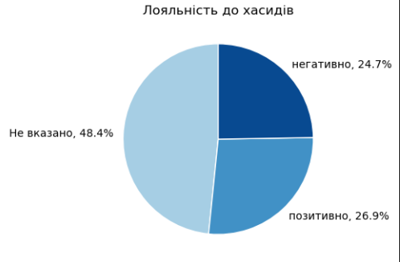
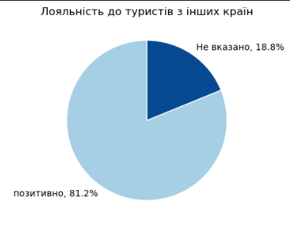

## Що думають мешканці та гості про туризм у Володимирі?
 
В рамках написання дипломної роботи, я вирішив дослідити, що ж насправді думають жителі міста про стан туристичної галузі у місті.
  Разом з @стародавній_володимир, @стан та Відділ_туризму було проведено опитування серед жителів та туристів міста Володимир, щоб з’ясувати, як вони оцінюють наш туристичний потенціал і що хотіли б бачити у майбутньому.

  
Всього було опитано 186 респондентів

  
Серед яких представники наступних проблем:

  <ul>
    <li>Працівники               - 55.23</li>
    <li>Приватні підприємеці   - 12.79</li>
    <li>Пенсіонери               - 11.63</li>
    <li>Тимчасово непрацевлаштовані     -  8.72</li>
    <li>Учні                   -  4.65</li>
    <li>Військовослужбовеці     -  4.65</li>
    <li>Студенти                 -  2.33</li>
  </ul>

  
Межа похибки результатів, при рівні довіри 95% складає 7,2%, що є середнім результатом для вибірки

### 🧑‍🤝‍🧑 Хто взяв участь?

- Учасники різного віку та статі.

- Більшість мешкає у Володимирі понад 20 років, але були й молодші респонденти, які живуть тут до 10 років.

### 👩👨 Розподіл по статті
В опитуванні прийняло участь:
- 👩 Жінок - 72,6%
- 👨 Чоловіків - 26,3%
- ❓ Не вказали стать - 1,1%
 

### Ставлення до хасидських паломників
- Рівень довіри до хасидських паломників крайнє незадовільний, лише 26,9% лояльні до туристів.

### Туристи з інших країн
Водночас щодо туристів з польщі жоден з респондентів не висловив негативного ставлення. Що задає загальний напрямок розвитку для населення міста.

Аналогічна ситуація спостерігається й щодо туристів з інших країн:

 

#### Для розуміння туристичного потенціалу міста, крайнє важливо розуміти рівень володіння населення іноземними мовами, що забезпечить якісну комунікацію з туристами

##### Англійська мова

##### Польська мова

